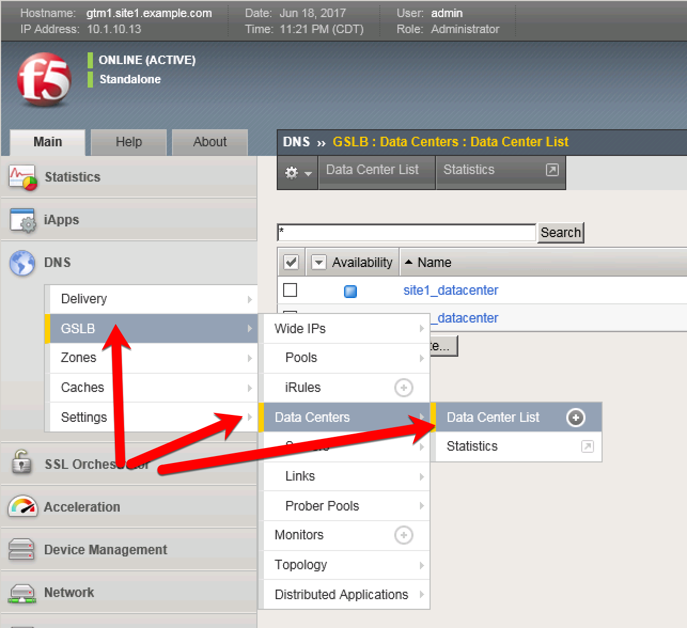

############################################
Datacenters
############################################

Navigate to: **DNS > GSLB > Data Centers > Data Center List: Create**

https://gtm1.site1.example.com/tmui/Control/jspmap/xsl/gtm_dc/list

.. note::   This task is only completed on gtm1.site1

Create two Data Centers as shown below. Retain defaults unless otherwise noted:

.. csv-table::
   :header: "Setting", "Value"
   :widths: 15, 15

   "Name", "site1_datacenter"
   "Name", "site2_datacenter"

TMSH command to insert a data center..
::
  create gtm datacenter <dc_name>

.. toctree::
   :maxdepth: 1
   :hidden:

   servers_hapairs.rst
   servers_standalone.rst
   trust.rst
   join-to_sync-group.rst
   virtuals.rst
   links.rst
   autodiscover.rst
