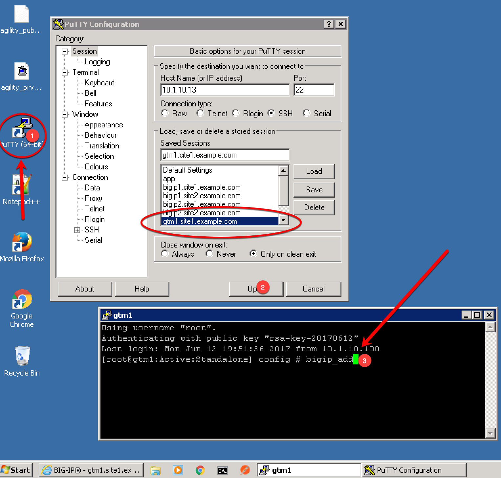
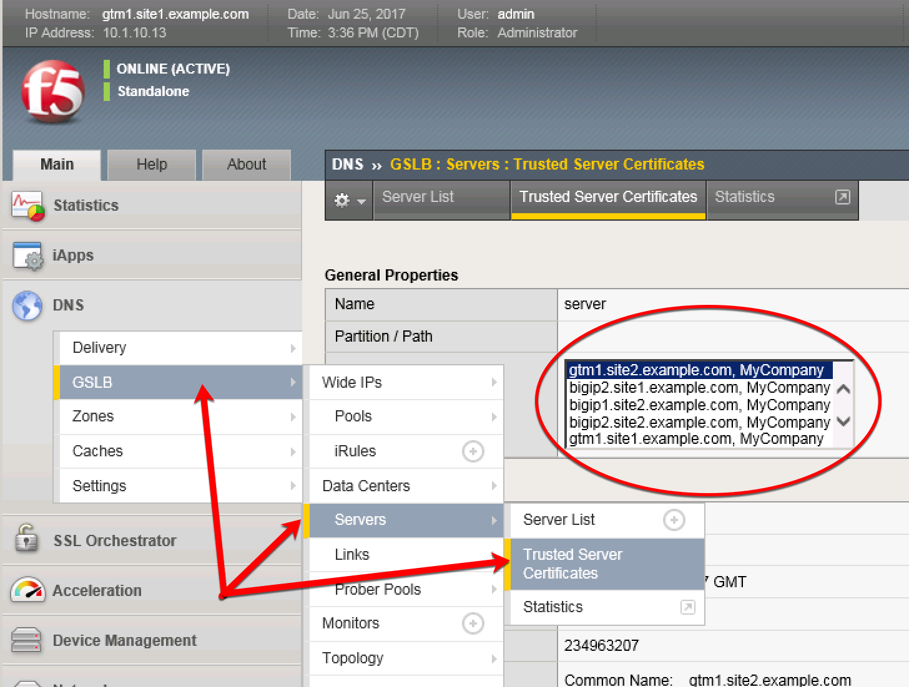

###############################################
Device Trust
###############################################

A mesh of F5 DNS servers need to exchange keys to establish a trusted mechanism for HA communications.

Lanch Putty and login to gtm1.site1.example.com
   username: *root* password: *default*

Run the following command:

   bigip_add

In the UI you should see:

https://gtm1.site1.example.com/tmui/Control/jspmap/tmui/locallb/ssl_certificate/properties.jsp?certificate_name=server&store=iquery

