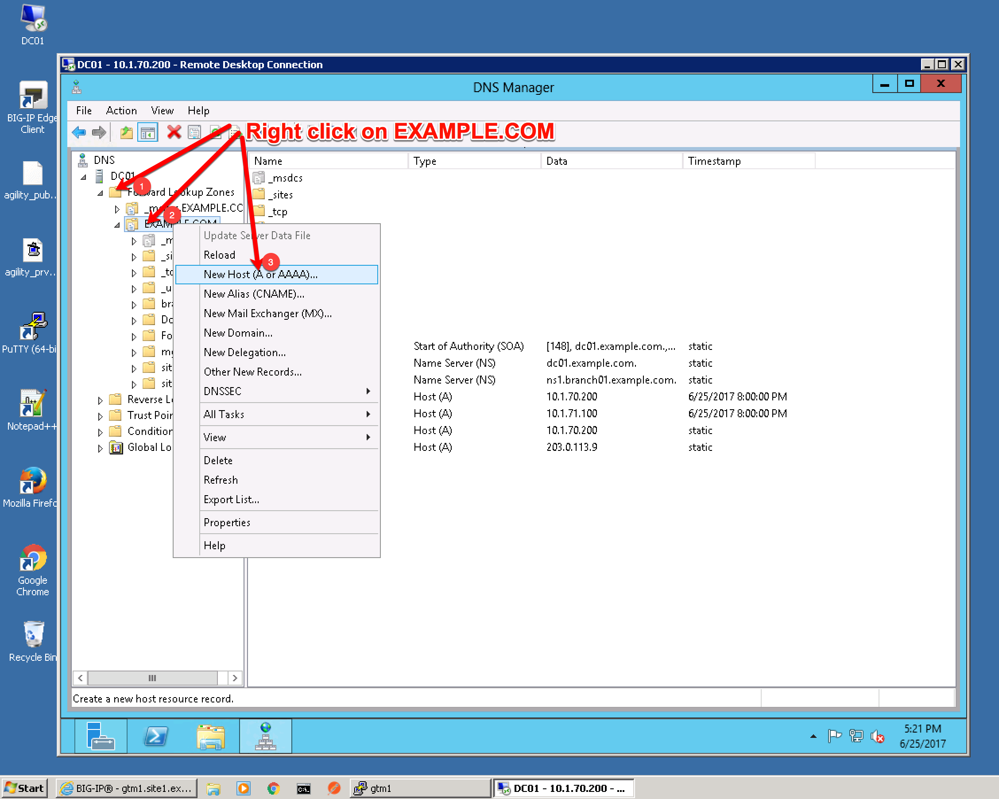

=================================
A Records
=================================

Create two new A records

.. csv-table::
   :header: "Setting", "Value"
   :widths: 15, 15

   "ns1.example.com", "203.0.113.8"
   "ns2.example.com", "198.51.100.40"

Expand "Forward Lookup Zones", right click on EXAMPLE.COM and select "New Host"

