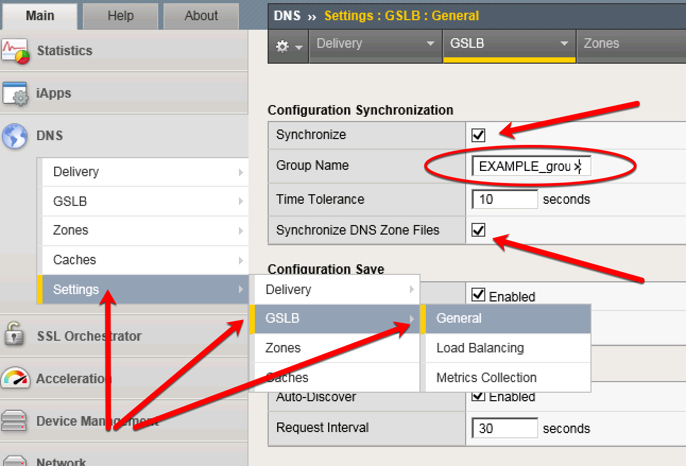

==================================
Cluster Properties
==================================

Configure the global settings for GSLB according to the following table:

.. csv-table::
   :header: "Setting", "Value", "Description"
   :widths: 15, 15, 30

   "Synchronize", "checked", "Not on by default"
   "Group Name", "EXAMPLE_group", "Org specific"
   "Synchronize DNS Zone Files", "checked", "BIND zone file updates"

.. rubric:: References
.. [#f1] https://support.f5.com/csp/article/K13734
.. [#f2] https://support.f5.com/kb/en-us/products/big-ip-dns/manuals/product/bigip-dns-implementations-12-0-0/4.html
