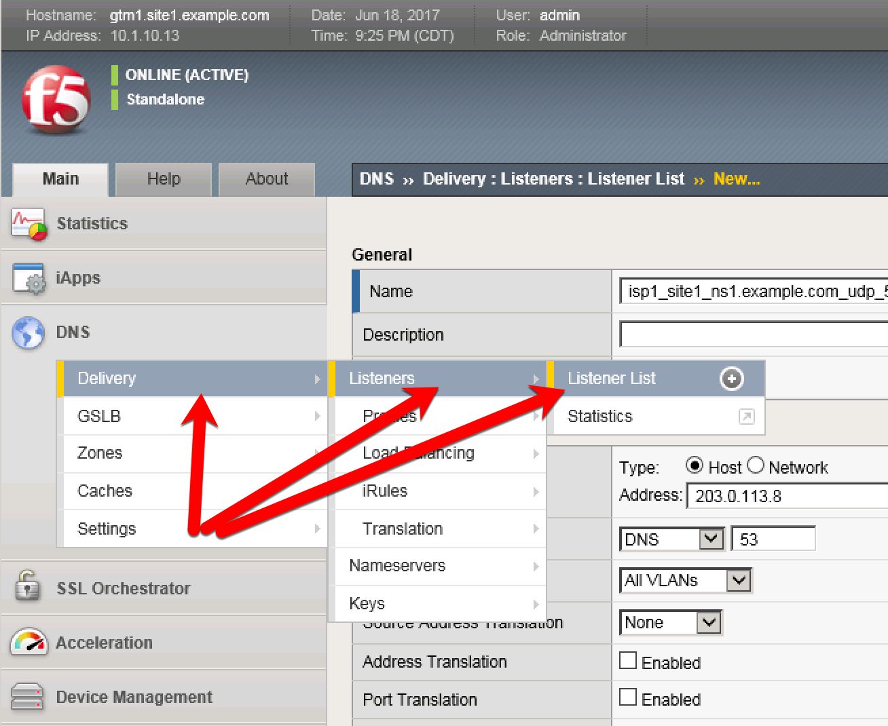
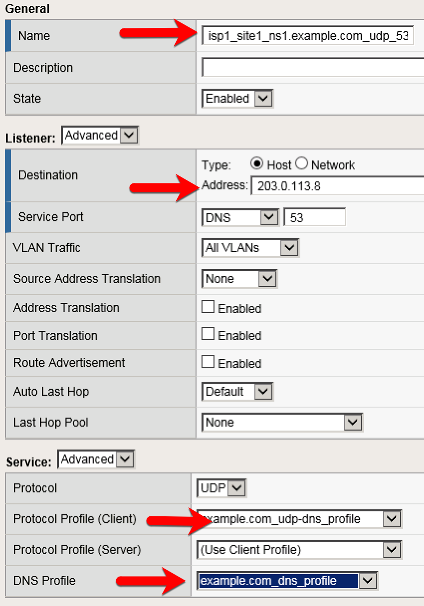

############################################
Listeners
############################################

A listener object is an spcialized virtual server that is configured to respond to DNS queries.

In the GUI, navigate to: **DNS  ››  Delivery : Listeners : Listener List**

https://gtm1.site1.example.com/tmui/Control/jspmap/tmui/dns/listener/list.jsp

https://gtm1.site2.example.com/tmui/Control/jspmap/tmui/dns/listener/list.jsp

.. note:: It is required to complete the following task on both gtm1.site and gtm1.site2

Create two listeners, one for UDP and the other for TCP with the values from the table below. Use defaults if not noted in the table.

.. csv-table::
   :header: "Setting", "gtm1.site1", "gtm1.site2"
   :widths: 15, 15, 15

   "Name", "isp1_site1_ns1.example.com_udp_53_virtual", "isp2_site2_ns2.example.com_udp_53_virtual"
   "Destination", "203.0.113.8", "198.51.100.40"
   "Protocol Profile (Client)", "example.com_udp-dns_profile", "example.com_udp-dns_profile"
   "DNS Profile", "example.com_dns_profile", "example.com_dns_profile"

TMSH command for adding a listener::
    ``create /gtm listener <name of listener> address <IP address on which you want the listener to alert GTM to DNS traffic> ip-protocol udp pool <name of pool> translate-address enabled ``

.. note:: Why do we need to create both a UDP and a TCP listener here?  What would happen if the DNS query or response was greater than 512 bytes?

.. rubric:: References

.. [#f1] https://support.f5.com/csp/article/K14923
