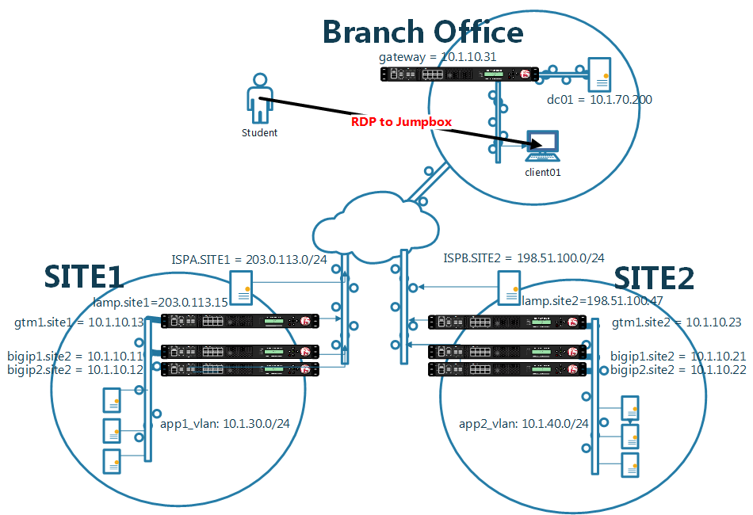

==================================
Lab Environment
==================================

* Connect to a Windows jumpbox in the cloud.
* From the Windows jumpbox students will configure F5 devices across two datacenters and a branch office.
* The Windows jumpbox is in the branch office along with an Active Directory domain controller.

.. toctree::
   :maxdepth: 1
   :hidden:

   ravello.rst
   #diagrams.rst
   ipv4-addresses.rst
   #ipv6-addresses.rst
   orientation.rst
